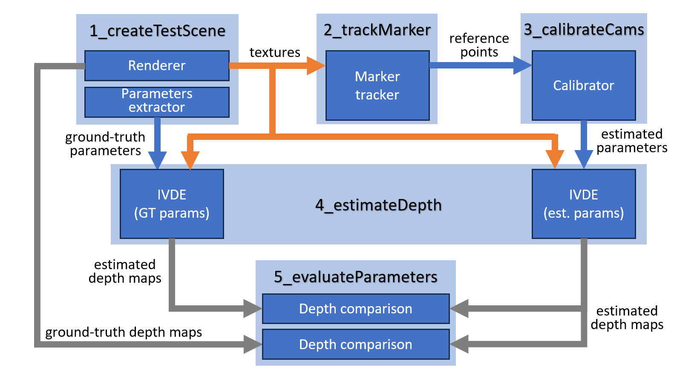

# ECPC - Extrinsic Camera Parameters Calibration software

## Prerequisites
Before using this software, ensure that the following requirements are in place:
- [Microsoft Visual Studio](https://visualstudio.microsoft.com/)
- [CMake](https://cmake.org/) 
- [Python](https://www.python.org/downloads/) (version 3.8 or newer supported by numba - version 3.11 on 21st Dec 2023 - [check currently supported version](https://numba.readthedocs.io/en/stable/release-notes.html))  
- Python modules installed: `numpy`, `scipy`, `openpyxl`, `numba` (for help in installing modules go to [Installing Python Modules](https://docs.python.org/3/installing/index.html))
- [Blender](https://www.blender.org/download/) (version 4.0 or newer)
- [FFmpeg](https://ffmpeg.org/) (the latest version of executables available e.g. [here](https://www.gyan.dev/ffmpeg/builds/ffmpeg-release-essentials.zip))
- [OpenCV](https://github.com/opencv/opencv) (easiest install can be performed using `vcpkg` - see [Appendix A.](#appendix-a---installing-opencv-via-vcpkg))


## Description

Overall scheme of this framework is shown below. Jump to [Instructions](#instructions---how-to-install-and-run-the-software) to prepare environment and run examples provided in this repository.



### 1. Blender project for generating of multiview calibration sequence

  To calibrate the multicamera system and evaluate the accuracy of estimated camera parameters, it is essential to provide proper calibration data and reference ground-truth data for comparison. To achieve this, a virtual scene created in Blender software is used, providing a controlled and constant test environment allowing for proper calibration and evaluation.

  The Blender project contains a representative example of a scene captured by a multicamera system, together with scripts allowing for outputting the multiview calibration sequence in an MVD representation (multiple views and depth). The provided scene includes 10 high definition virtual cameras arranged on an arc, modeling systems often used in immersive video applications. However, as underlined earlier, all modules of the ECPC software do not have any constraints on camera arrangement, thus users of the software can arbitrarily modify it to model the arrangement of their interest.

The calibration algorithm estimates the positions of cameras on the basis of the positions of reference points, which are provided by tracking a calibration object. In ECPC, this marker is an orange ball moving through the scene volume.


### 2. Marker tracking

  The second module analyzes the calibration sequence generated in the previous step and outputs the position of the marker in each frame and view. The marker positions are stored in the output file containing the horizontal and vertical coordinates and a visibility flag indicating if the marker was visible by the camera in an analyzed frame.

  The marker detection algorithm is performed by analyzing both chroma components of the calibration sequence. All the pixels detected as orange (i.e., their chromas are: Cb ∈ [50, 70] and Cr ∈ [155, 195]) are in the first step segmented into clusters.

  In the first frame, the largest cluster characterized by a high circularity coefficient is selected. Then, this cluster is tracked in the following frames, so the calculation of its accurate position does not require analysis of the entire frame because of the movement prediction 

### 3. Calibration

  The calibrator module serves as the core module of the ECPC software and is responsible for determining the extrinsic parameters for the multicamera system. The underlying calibration algorithm is based on minimizing the total distance between corresponding reference points from multiple views and their respective epipolar lines. The optimization process is carried out by L-BFGS (limited-memory Broyden–Fletcher–Goldfarb–Shanno) algorithm, commonly used to solve problems with large numbers of variables, and minimizes an error function 

  In the proposal, the calibration process can be performed in one or more global iterations. After each global iteration, the method excludes outliers from a list of input marker positions and repeats the process. A point is treated as an outlier if its error (i.e., its distance from the corresponding epipolar line) is tenfold larger than average error. Therefore, even if some input points represent erroneously detected objects (e.g., due to partial occlusion of calibration marker or temporary changes in the scene’s lighting), they can be automatically detected and removed from the optimization.

  The calibrator tool generates a .json file with sequence parameters, that will can be directly used for the depth estimation process.

 
### 4. Depth estimation

  In the ECPC software, the accuracy of estimated parameters is evaluated by comparing depth reference depth maps with the ones estimated based on camera parameters received in the previous step.

  To provide fast and reliable comparison, the ISO/IEC MPEG Video Coding reference software for depth estimation was used – IVDE (Immersive Video Depth Estimation), as it provides good quality depth maps for multiview systems with arbitrary camera arrangements and is publicly available on the [MPEG public software repository](https://gitlab.com/mpeg-i-visual/ivde/-/tree/v7.0).
  
  The IVDE software, as an external component, is integrated into the ECPC repository as an independent part using the Git submodule feature.


### 5. Evaluation

  In the last step, the estimated depth maps are compared to assess the accuracy of estimated extrinsic camera parameters by means of the number of pixels with a wrong depth value (“bad pixels”). 
  
  The number of bad pixels is calculated in two different ways. In the first type of evaluation, depth maps estimated using calculated extrinsic parameters are compared with ground-truth depth maps, directly rendered by Blender (first “depth comparison” block). The second evaluation (second “depth comparison” block) is based on comparison of the depth maps estimated using calculated extrinsic parameters with depth maps estimated using ground-truth extrinsic parameters (extracted from Blender).

  By default, the number of bad pixels is calculated for several δ threshold values representing 1%, 2%, and 4% of the range represented by a 16-bit depth map.


## Instructions - how to install and run the software

To clone the repository to your computer:

> `git clone https://github.com/bszydelko/ecpc.git`

Then, update submodules:

> `cd ecpc`

> `git submodule init`

> `git submodule update`


The framework contains scripts to be run in a specific order, the scripts are numbered accordingly. The time required to run all stages (from rendering test sequence to the evaluation of camera parameters) is around 30 minutes.

### Step 0 - Prepare environment, build and install

#### Prerequisites

Windows users having OpenCV installed using vcpkg are required to provide location of OpenCV toolchain file as a environmental variable:  
`SET CMAKE_TOOLCHAIN_FILE=[PATH_TO_VCPKG]vcpkg/scripts/buildsystems/vcpkg.cmake` where **PATH_TO_VCPKG** points to location of vcpkg root directory.  
Exemplary, if vcpkg is installed in C:/Tools/ the command typed into the command line will be:  
`SET CMAKE_TOOLCHAIN_FILE=C:/Tools/vcpkg/scripts/buildsystems/vcpkg.cmake`

**Please note that environment variables are only available for the current console session and will not persist after it is closed.**

#### Execute

> `python 0_buildSoftware.py`
 
This script is responsible for building tools used whithin this framework. Compiled projects are located in **DepthEstimation/ivde/build** and **MarkerTracking/build**. In current state only Visual Studio solution is supported.

### Step 1 - Test scene creation

#### Prerequisites

Windows users should add path to Blender and ffmpeg to *PATH* environmental variable. The example for default installation folder of Blender and ffmpeg is provided below. If Blender or ffmpeg is installed in another location - the command should be modified accordingly.  
`SET PATH=%PATH%;"C:/Program Files/Blender Foundation/Blender 4.0";"C:/ffmpeg"`

#### Execute

>`python 1_createTestScene.py` 

This script renders multiple viewpoints of scene created in Blender. Views are outputted in MVD format (multiview plus depth), ground-truth camera parameters are also saved. To provide compatibility with MPEG Immersive Video environment, views and depth maps are converted into “yuv” format using ffmpeg. Files will be created in `1_renderedScene` directory.

Note: the script requires approximately 5-10 minutes to render views, the progress can be seen in command line window (Blender window will be blank during rendering).

### Step 2 - Calibration points generation

#### Execute 

> `python 2_trackMarker.py`

This script starts MarkerTracker and extracts the marker position from rendered scenes. Files will be created in `2_trackedMarker` directory.

**Note:** See [Appendix B](#appendix-b---ideal-calibration-points) for ideal calibration points.

### Step 3 - Calibration

#### Execute

> `python 3_calibrateCameras.py`

The calibration script generates an output files estimatedParams_itN.json (where N is the number of a global iteration) containing calibrated camera parameters. Files will be created in `3_calibration` directory.

### Step 4 - Depth reconstruction

#### Execute
> `python 4_estimateDepth.py`

Further steps of the provided example evaluate the accuracy of calibrated camera parameters through the quality of depth maps estimated on their basis. This script executes IVDE and calculates two sets of depth maps: using reference parameters and using calibrated camera parameters. The estimation of depth maps takes ~4 minutes for each set (on Ryzen 5900X CPU). Files will be created in `4_depthMaps` directory.

### Step 5 - evaluation

#### Execute
> `python 5_evaluate.py`

Script evaluates the precision of calibrated camera parameters through measuring the quality of estimated depth maps. Results are outputted into `5_evaluation/results.xlsx` file.


### How to change framework parameters

Framework parameters can be set in `globalSetup.py` file:
```
#starting parameters:
start_frame = 0
end_frame = 2000
step_frame = 10
#closest and furthest depth value:
znear = 10
zfar = 200
#resolution of the calibration sequence:
width = 1920
height = 1080   
#number of cameras used to captrure the calibration sequence:
num_of_cams = 10  
```

## Appendix A - Installing OpenCV via vcpkg
Clone [vcpkg repository](https://github.com/Microsoft/vcpkg). Run bootstrapping process:
> `./vcpkg/bootstrap-vpkg.bat`

Install OpenCV:

>`./vcpkg/vcpkg install opencv`


 ## Appendix B - Ideal calibration points
 ECPC provides script for extracting ideal marker coordinates in scene. In order to obtain it, execute:
 > `blender -b TestScene/scene.blend --python scripts/extractMarker.py`